<!-- NAME / TAGLINE — animated typing -->

 

<!-- SOCIALS -->
&nbsp;&nbsp;
&nbsp;&nbsp;
&nbsp;&nbsp;
&nbsp;&nbsp;
&nbsp;&nbsp;

  

---

## About

I'm **Shivansh Mishra**, an AI/ML developer working toward **autonomous research**. Currently pursuing an Integrated B.Tech–M.Tech in Computer Science & Engineering at **CSMU** (expected 2029).

My focus is on the fundamentals that make intelligent systems work — from classical machine learning to the architectures that power modern deep learning. I'm building a foundation I can stand on for the long term: **neural networks, transformers, and reinforcement learning** studied from the ground up, then applied to real problems.

-  **Current direction:** Deep Learning, Neural Networks, and the path toward autonomous research agents
-  **Studying:** ANN, CNN, RNN, Transformers, and reinforcement learning
-  **Mission:** Help people — through research, teaching, and building things that matter
-  **Writing in public** at [Substack](https://substack.com/@smileoficarus): notes on what I'm learning, explained plainly
-  **Teaching on [YouTube](https://www.youtube.com/@Letscodeshivansh)**: coding walkthroughs for people who want to build
-  Open to conversations about deep learning, research directions, and student collaboration

 

## Stack

---

## Selected Work

<table>
<tr>
<td width="50%" valign="top">

### Reinforcement Learning — Cliff Walking
Classical RL implemented from scratch: Q-learning on the gridworld problem, exploring exploration vs. exploitation.

[→ View repo](https://github.com/Shiv7019/reinforcement-learning-cliffwalking)

</td>
<td width="50%" valign="top">

### Digit Classification — CNN & RNN
Handwritten digit recognition comparing convolutional and recurrent approaches on image data.

[→ View repo](https://github.com/Shiv7019/Digit-Classification-using-CNN-RNN)

</td>
</tr>
<tr>
<td width="50%" valign="top">

### Neural Networks — Regression & Classification
Building neural nets from first principles for both regression and classification tasks.

[→ View repo](https://github.com/Shiv7019/neural-network-regression-classification)

</td>
<td width="50%" valign="top">

### SmartCart — Unsupervised ML
Customer segmentation and pattern discovery using unsupervised learning techniques.

[→ View repo](https://github.com/Shiv7019/SmartCart-Unsupervised-Machine-Learning)

</td>
</tr>
</table>

---

## Metrics

<!-- Stats + top-langs: generated by .github/workflows/grs.yml, committed to profile/ -->

 

  

<!-- Streak: external service, but a different one from the 502'd github-readme-stats -->

  

<!-- Activity graph: external service, separate from github-readme-stats -->

  

<!-- Contribution snake: served from your own repo's output branch -->
<picture>
  <source media="(prefers-color-scheme: dark)" srcset="https://raw.githubusercontent.com/Shiv7019/Shiv7019/output/github-contribution-grid-snake-dark.svg">
  <source media="(prefers-color-scheme: light)" srcset="https://raw.githubusercontent.com/Shiv7019/Shiv7019/output/github-contribution-grid-snake.svg">
  
</picture>

---

Learning in public · Building to help people · @Shiv7019

